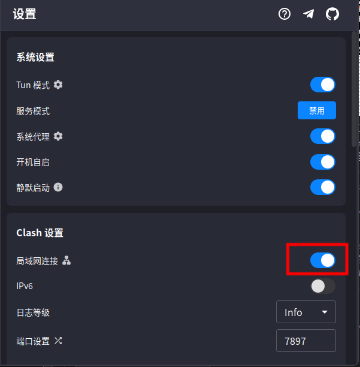

# Proxy


## 一机代理

- 设置代理

```bash
# HTTP/HTTPS 代理
export http_proxy=http://127.0.0.1:7897
export https_proxy=http://127.0.0.1:7897
export HTTP_PROXY=http://127.0.0.1:7897
export HTTPS_PROXY=http://127.0.0.1:7897

# Socks5 代理
export all_proxy=socks5://127.0.0.1:7897
export ALL_PROXY=socks5://127.0.0.1:7897

# 如果要持久化，可以将上述命令添加到 ~/.bashrc 或 ~/.zshrc

# 或者一步到位
export all_proxy=http://localhost:7897
export all_proxy=https://localhost:7897
export all_proxy=socks5://localhost:7897
```

- 取消代理

``` bash
unset http_proxy
unset https_proxy
unset HTTP_PROXY
unset HTTPS_PROXY
unset all_proxy
unset ALL_PROXY
```

此链接还包含 windows代理、git代理、pip代理、conda代理、docker代理、wget、curl、apt代理等常用工具的代理配置：https://blog.nim.im/documents/%E5%B8%B8%E7%94%A8%E4%BB%A3%E7%A0%81%E5%9D%97/Proxy.html


## 二机代理：服务器与本机

注：本机代表用户自己电脑，服务器代表服务器

### 法1：反向代理

#### 本机端

clash等软件打开“局域网连接”



#### 服务器端

终端输入

```bash
export all_proxy=http://本机ip:7897
export all_proxy=https://本机ip:7897
export all_proxy=socks5://本机ip:7897
```


### 法2：正向代理

#### 本机端

``` bash
ssh -R serverport:localhost:clashport servername@serverip -N -p sshport

ssh -R 1080:localhost:7897 yuanxin@10.12.218.211 -N -p 23422
```

- `-R` 是 SSH 的反向端口转发选项。

- `1080:localhost:7897`指定了端口转发的映射关系：

  - `1080`：远程服务器上的端口，表示服务器上的 1080 端口将被转发。
  - `localhost`：本地主机的地址，表示本地主机上的 7897 端口将被映射到远程服务器的 1080 端口。
  - `7897`：本地主机上的端口，表示本地的 7897 端口将被远程服务器的 1080 端口访问。

- 这意味着，当远程服务器上的 1080 端口被访问时，实际上会连接到本地主机的 7897 端口

  

#### 服务器端

```bash
export all_proxy=http://localhost:7897
export all_proxy=https://localhost:7897
export all_proxy=socks5://localhost:7897
```

