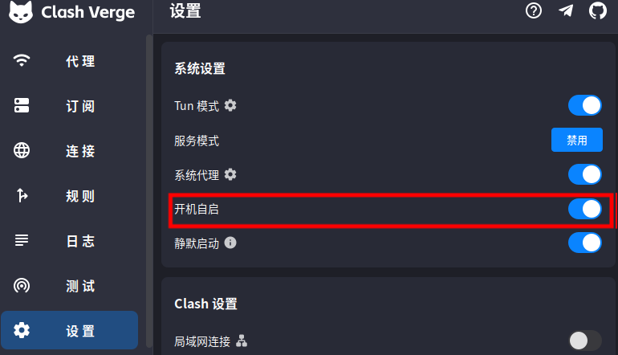

# 校园内网、l2tp、clash启动顺序问题


## 问题

1. **依赖顺序问题**
   - Clash 依赖 L2TP VPN 提供的国内网络，而 L2TP 又依赖有线网络。但 Ubuntu 默认不会自动连接 L2TP。
   - 如果 Clash 先启动，它会劫持所有流量，但此时 L2TP 未连接，导致既无国内也无国际网络。
2. **路由冲突**
   - Clash 和 L2TP 都会修改系统路由表，若顺序不当会导致路由混乱。


## 发现

1、clash的自启动需要在进入图形化界面之后

2、L2TP的连接，利用开机自启动，可以在进入图形化界面之前完成


## 解决方法

1、创建l2tp_vpn开机自启动项

`sudo vim /etc/systemd/system/l2tp-vpn-autoconnect.service`

``` bash
[Unit]
Description=Auto-connect L2TP VPN
After=network-online.target NetworkManager-wait-online.service
Requires=network-online.target

[Service]
Type=oneshot
ExecStart=/bin/sh -c 'if ! nmcli -t -f GENERAL.STATE con show "zju_theo" | grep -q "activated"; then /usr/bin/nmcli connection up "zju_theo"; fi'  ##zju_theo改为自己设置的l2tp_vpn名称，还有要把这串注释内容删除
Restart=on-failure
RestartSec=5s

[Install]
WantedBy=multi-user.target
```

2、启用服务

`sudo systemctl restart l2tp-vpn-autoconnect.service`
`sudo systemctl status l2tp-vpn-autoconnect.service`

3、clash 设置开机自启动

 

clash会在进入图形化界面后再启动，天然契合了“Clash 依赖 L2TP VPN 提供的国内网络，而 L2TP 又依赖有线网络”的运行顺序
